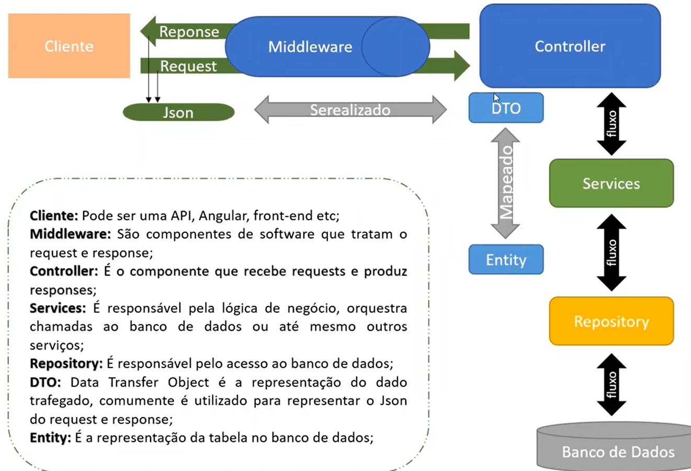
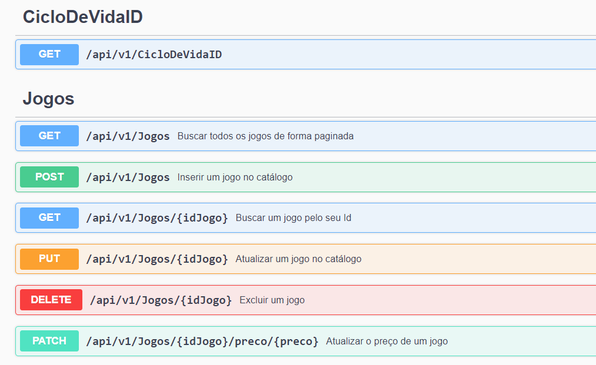

# Criando um catálogo de jogos com ASP.NET Core Web API

Essa API foi criada como parte do _Criando um catálogo de jogos usando boas práticas de arquitetura com .NET no <a href="https://web.digitalinnovation.one/track/gft-start-2-net">Bootcamp GFT Start #2 .NET</a> da <a href="https://www.linkedin.com/company/gft-group/">GFT</a> pela plataforma da <a href="https://web.digitalinnovation.one/home">Digital Innovation One</a> e foi apresentado pelo <a href="https://www.linkedin.com/in/thiago-campos-de-oliveira-693a3840/">Thiago Campos</a>.

<li>Swagger - Consultar Métodos HTTP

<li><a href="https://docs.microsoft.com/pt-br/dotnet/api/system.guid?view=net-5.0">Guid</a>
<li>Versionamento
<li><a href="https://docs.microsoft.com/pt-br/dotnet/api/system.windows.annotations.annotation?view=net-5.0">Data Annotations</a> 
<li><a href="https://docs.microsoft.com/pt-br/dotnet/api/system.iformatprovider?view=net-5.0">IFormat Interfaces</a>
<li> Método path - Atualizar parte do recurso.
<li>Paginação
<li>Middleware - Pipelines - fazer tratativas no request e return.
<li><a href="https://docs.microsoft.com/pt-br/dotnet/api/system.data.sqlclient.sqlconnection.connectionstring?view=dotnet-plat-ext-5.0">Conexão e mudança de banco de dados</a>

## NuGet's Packages

<li><a href="https://www.nuget.org/packages/Swashbuckle.AspNetCore">Swashbuckle.AspNetCore</a>	
<li><a href="https://www.nuget.org/packages/System.Data.SqlClient/
">System.Data.SqlClient</a>
 

"Deixe simples, reduza códigos"

"Refatore"

